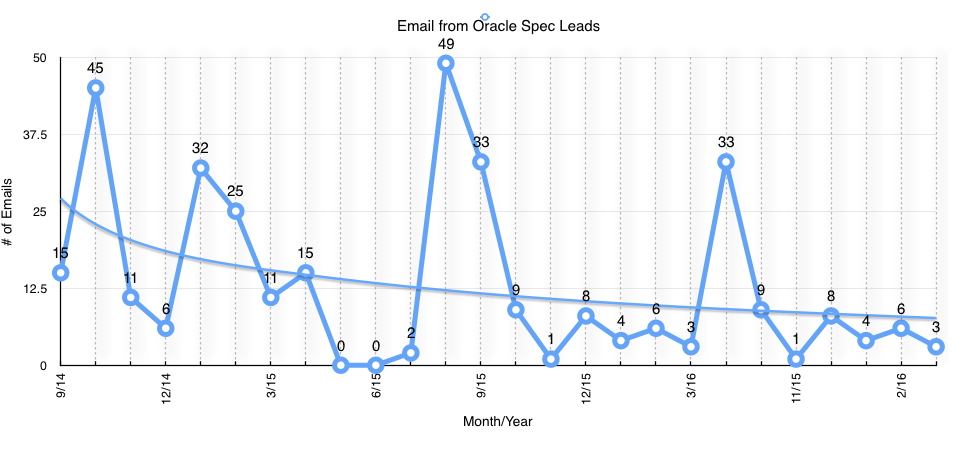
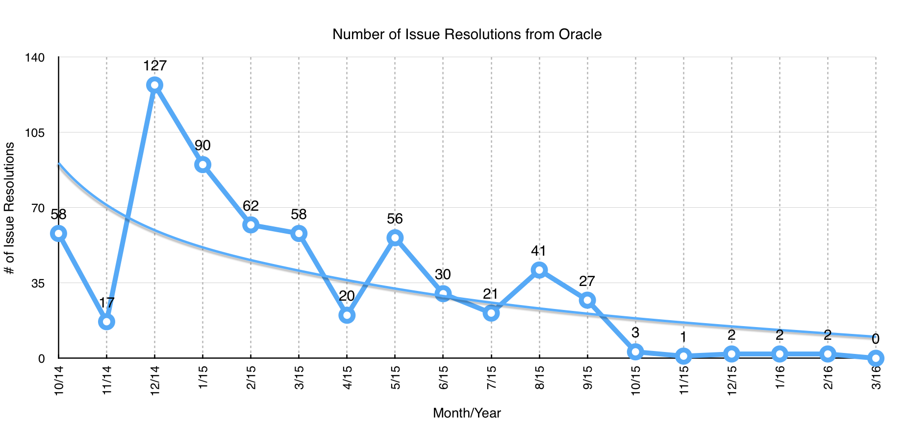
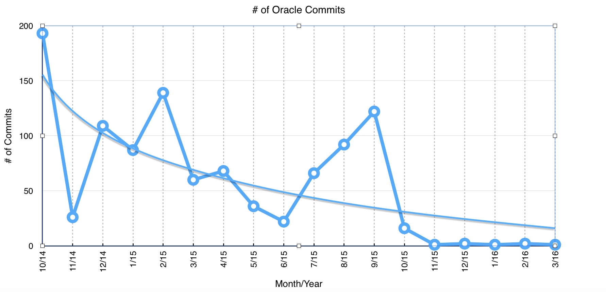
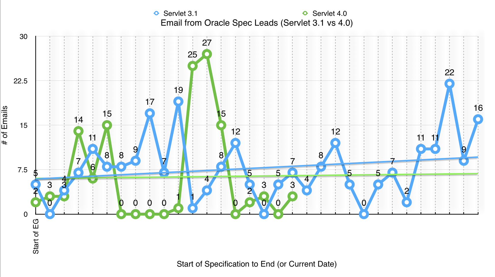
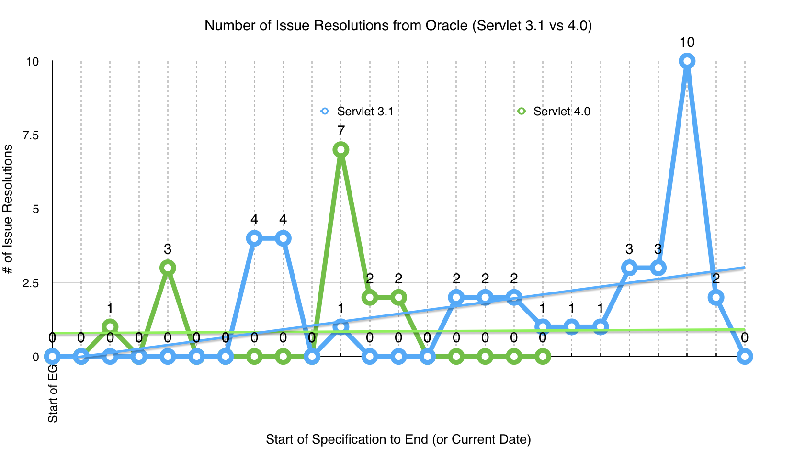
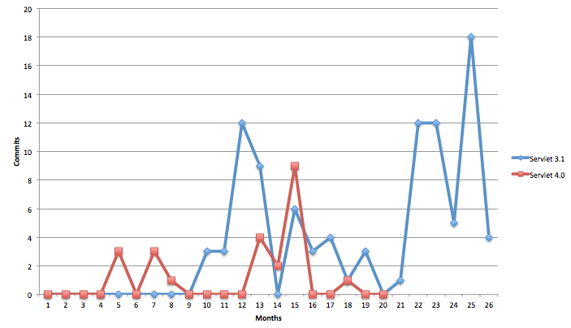
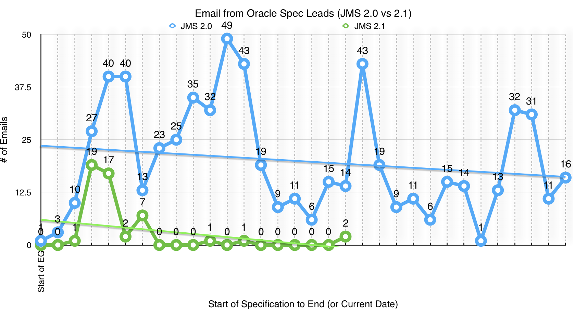
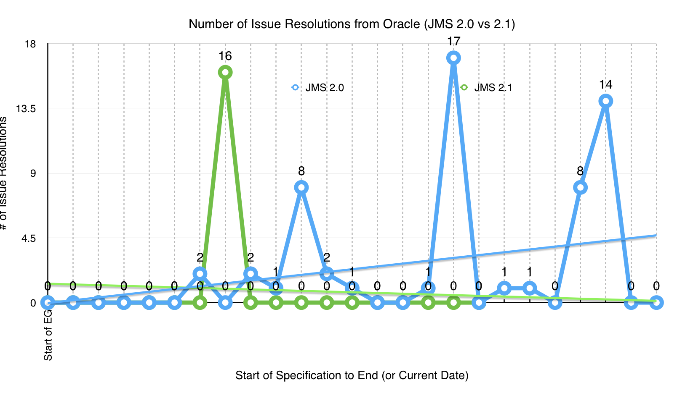

= Java EE Guardians

Java EE is incredibly important to the long term health of the entire
Java ecosystem. This is because of the basic fact that Java on the
server will remain mission critical to global IT in the foreseeable
future. Evidence of this is not hard to see for most reasonably
objective folks:

* Hundreds of thousands of applications worldwide are written in Java EE, many of those applications are regularly being brought to light [link: Adoption Stories]. Even applications and frameworks that claim they do not use Java EE are in fact heavily dependent on many Java EE APIs today and going forward.
* There were no less than 4,500 input points to the groundbreaking survey to determine Java EE 8 features [link: https://blogs.oracle.com/theaquarium/entry/java_ee_8_survey_final].
* In major survey after survey developers continue to show their strong support for Java EE and its APIs [link: Java EE Surveys].
* Java EE vendors are some of the most enviably profitable in our industry certainly including Oracle. [link: TODO Java EE Vendor Profits]
* Few multi-vendor open standards are as widely implemented, supported, depended upon or as widely participated in as Java EE.
* There is an extremely passionate, responsible community behind Java EE - most technologies would be hard pressed to find anything like the Java EE community. This group is a testament to this fact.

Despite all this there is growing evidence [link: Java EE Progress]
that Oracle is seriously neglecting Java EE, significantly weakening
a very broad ecosystem along with it. At the current trajectory
Java EE 8 won’t be delivered in anywhere near the time when it was
initially promised if it is delivered at all.

It is difficult to determine why this neglect from Oracle is
occurring. Oracle has not shared it’s motivations even with
it’s closest commercial partners let alone the community. A
very troubling possibility is that it is being done because
Oracle is backing away from an open standards based collaborative
development approach and instead pursuing a highly proprietary,
unilateral path even if it is aware this path is unlikely to lead
to broad technology adoption or monetization.

This brings us to the question of what can be done. You should
carefully note the surprisingly achievable work we are already
doing and what we plan to do in order to move Java EE forward
[link: What We are Doing]. We already have many key individuals,
organizations and Java User Groups committed to solving this
problem [link: Who Stands with Us].

As committed as we are we still need to effect change in a company
with the size, scope and resources of Oracle. Getting Oracle to
adapt to the legitimate interests of people outside of itself -
even its own customers - has proven challenging in the past and
we have no reason to believe it will be easy this time. The Java EE
community really needs your help - no matter how big or small.
We need the support of your voice and perhaps your volunteer time
if you can afford it. These are the many ways you can help
[link: How Can I Help].

There is no denying there is plenty to be very concerned about for
Java EE as well as the overall Java ecosystem - unless we change
things for the better. We believe that with hard work together -
including Oracle - we can prove that this is actually the dawn of
a new era for an ever brighter future for Java, Java EE and
server-side computing.

= Adoption Stories

* Java EE in Practice at Lufthansa Industry Solutions [link: https://blogs.oracle.com/theaquarium/entry/java_ee_in_practice_at]
* Java EE 7 in Production at Commerzbank [link: https://blogs.oracle.com/theaquarium/entry/java_ee_7_in_production1]
* Migrating from Java EE 5 to Java EE 7 at Segurnet Portugal [link: https://blogs.oracle.com/theaquarium/entry/migrating_from_java_ee_5]

= Java EE Surveys

* Developers Continue to Affirm Strong Support for Java EE 7 [link: https://blogs.oracle.com/theaquarium/dentry/developers_continue_to_affirm_strong]
* Developers Affirm Strong Support for Java EE 7 in DZone Szurvey [link: https://blogs.orCacle.com/theaquarium/entry/developers_affirm_strong_support_for]
* Some Interesting Real World CDI Usage Statistics [link: https://blogs.oracle.com/theaquarium/entry/some_interesting_real_world_cdi]
* DZone Survey Shows JPA Dominates Java Persistence [link: https://blogs.oracle.com/theaquarium/entry/dzone_survey_shows_jpa_dominates]
* Survey Confirms JSF Remains Leading Web Framework [link:https://blogs.oracle.com/theaquarium/entry/survey_confirms_jsf_remains_leading]

= Java EE Progress

For months, those of us very close to the Java Community
Process (JCP) have noticed a marked slowdown in development
on Java EE 8 JSRs led by Oracle. Indeed there have been many
anecdotes of Oracle specification leads themselves stating
that they are unable to make adequate progress on Java EE
standardization work. We will try to avoid citing those instances
specifically to protect these good people at Oracle. Thanks to
the openness of the JCP, we can now demonstrate what is clearly
happening using objective publicly available data [footnote:
Java EE JSRs are operated in the open and all Java EE reference
implementations today are open source. Expert group user alias
email activity, JIRA issue activity and open source commit
activity are all archived and publicly available on java.net
and GitHub].

Oracle had already acknowldged a significant delay shipping
Java EE 8 [link: https://blogs.oracle.com/theaquarium/entry/java_ee_8_roadmap_update].
This meant that Java EE 8 would take longer than Java EE 7
despite being far more limited in scope. As you’ll see below
if the current pattern of inactivity holds, even that delayed
release date looks severely unrealistic.

As a first important step we have already included data and analysis
for some key Java EE 8 JSRs below. We will continue to add the data
for more Java EE 8 JSRs as quickly as we can. The general pattern
of inactivity is very similar across Oracle led Java EE 8 JSRs and
already pretty clear in the JSR analysis we have below. These
patterns will only strengthen as we add data for more and more
JSRs, so please check back on this section periodically.

== Java EE

The umbrella specification itself is the first being underworked.
If you compare the activity of the Java EE mailing list through
history, you will notice a decrease:

* Java EE 6 (jsr-316-eg@jcp.org) : 195 threads of discussion (that’s a few thousands emails exchange)
* Java EE 7 (jsr342-experts@javaee-spec.java.net) : 177 threads of discussion
* Java EE 8 (jsr366-experts@javaee-spec.java.net) : 28 threads of discussion so far

== JSF

The image below shows the number of emails to the expert group
alias by Oracle specification leads. Emails are the principal
means the JCP expert group collaborates through and specification
lead emails are critical since they are the key decision makers.
As can be clearly seen, JSF starts on a strong note but levels
off consistently as time progresses.

The picture becomes even clearer when we look at the number of
JIRA issue resolutions by Oracle. As can be seen there is a
sudden sharp drop of activity after October 2015 - the general
trend is downward after a strong start.

The same pattern is further crystallized when we look at the number of code
commits from Oracle.

Here is the current declared schedule for JSF:

* Early Draft - Q4 2015
* Public Review - Q1 2016
* Proposed Final Draft - Q3 2016
* Final Release - H1 2017

The early draft date was met in October 2015 before the sudden
drop in activity accurred. The public review draft is due in just
a month but because of the lack of activity no progress towards it
has happened which means JSF is now already behind by close to four
months and things are getting worse as time presses on.

== Servlet

The situation for the critical Servlet specification is very
worrisome. For perspective the Servlet 3.1 specification was a
minor update to the 3.0 specification. Servlet 4 by comparison
is the most significant update to the specification in many
years - bringing standard HTTP/2 support to server-side Java
developers. Given these facts we should expect significantly
higher levels of activity in Servlet 4 as compared with
Servlet 3.1. As we can see from the data for emails from
Oracle specification leads as well as the number of issue
resolutions, the opposite is happening. Activity was low to
begin with by comparison to 3.1 and getting even lower as
time presses on. In both graphs there is a very short-lived
sudden spike representing work done to produce the early draft
during the October 2015 time frame.

The same pattern is further crystallized when we look at the
number of artifact commits from Oracle. Commits to the
specification are essentially down by 50% compared with
Servlet 3.1. Indeed approximately 40% of the total commits
for Servlet 4 was in October of 2015. Activity dropped off
after that and there has been only 1 commit in the last
four months.

Here is the current declared schedule for Servlet:

* Early Draft - Q4 2015
* Public Review - Q1 2016
* Proposed Final Draft - Q3 2016
* Final Release - H1 2017

The early draft date was met in October 2015 as is reflected
by the very brief spike in activity. The public review draft
is due in just a month but because of the lack of activity a
timely public review is highly unlikely. Servlet is likely
behind by close to five/six months and things are getting
worse as time presses on.

== JMS

The situation for JMS is quite a bit worse. Activity in the
specification was very meager all along and is now at a complete
deadstop. Comparing data for JMS 2 and JMS 2.1 so far tells a
very crystal clear story.

Here is the current declared schedule for JMS:

* Early Draft - Q4 2015
* Public Review - Q1 2016grvkm
* Proposed Final Draft - Q3 2016
* Final Release - H1 2017

The early draft date was met in October 2015 as is reflected by
the very brief spike in activity for JMS 2.1. The public review
draft is due in just a month but because of the total lack of
activity a timely public review is highly unlikely. JMS is
likely behind by close to five/six months and things are getting
worse as time presses on.

* link:what_we_are_doing.adoc[What We are Doing]
* link:who_stands_with_us.adoc[Who Stands with Us]
* link:java_user_groups.adoc[Java User Groups]
* link:companies.adoc[Companies]
* link:how_can_i_help.adoc[How Can I Help]
* link:java_ee_vendor_profits.adoc[Java EE Vendor Profits]
